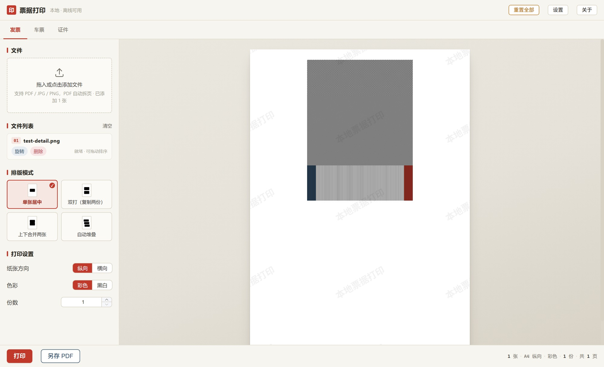
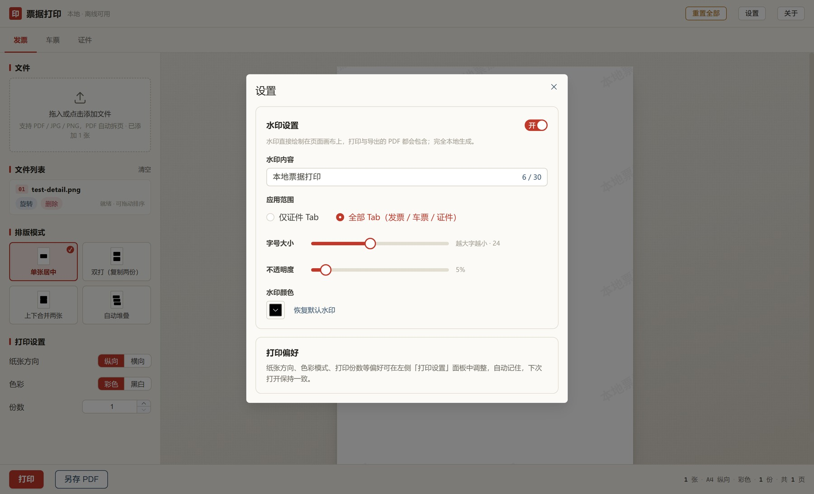
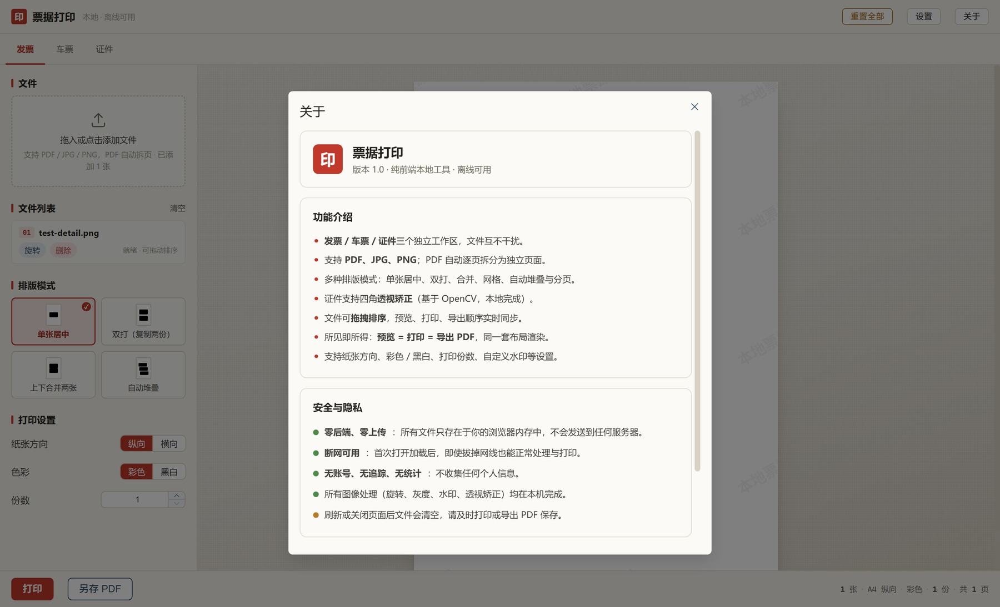

<div align="center">

# 🧾 票据打印 · Print Tools

**纯前端 · 本地运行 · 离线可用** 的票据 / 证件排版打印工具

把 PDF、JPG、PNG 发票、车票、证件按多种模式排到 A4 纸上，所见即所得地打印或导出 PDF。


### 👉 [点此立即在线使用](https://ztoooooo.github.io/print-tools/)

**https://ztoooooo.github.io/print-tools/**

</div>

---

## 📸 界面预览

<div align="center">

### 工作台
图片保留原始分辨率，页面按 **300 DPI** 合成，预览 / 打印 / 导出一样清晰；可自定义水印。



</div>

<table>
<tr>
<td width="50%" align="center">
<b>设置 · 水印</b><br><br>
水印内容、应用范围、字号、不透明度与颜色均可调
<br><br>

</td>
<td width="50%" align="center">
<b>关于 · 安全说明</b><br><br>
零后端零上传，功能与隐私一目了然
<br><br>

</td>
</tr>
</table>

---

## ✨ 功能特性

| 模块 | 说明 |
| --- | --- |
| 🗂️ **三个工作区** | 发票、车票、证件独立隔离，文件互不干扰 |
| 📄 **多格式支持** | PDF 自动逐页拆分，JPG / PNG 直接导入 |
| 🧩 **多种排版** | 单张居中、双打、上下合并、左右两联、2×2 网格、自动堆叠分页 |
| 🔍 **高清渲染** | 图片保留原始分辨率，页面按 300 DPI 合成，锐利不糊 |
| 💧 **自定义水印** | 内容、范围、字号、不透明度、颜色自由配置 |
| ↕️ **拖拽排序** | 文件列表拖动即重排，预览与导出顺序实时同步 |
| 📐 **透视矫正** | 证件四角矫正（OpenCV WASM 懒加载，本地完成） |
| 🎯 **所见即所得** | 预览 = 打印 = 导出 PDF，共用同一布局真源 |
| 💾 **偏好持久化** | 纸张方向、色彩、份数等设置自动记住 |

---

## 🚀 快速开始

**环境要求：** Node.js 18+（推荐 20+），npm / pnpm / yarn

```bash
# 1. 安装依赖
npm install

# 2. 启动开发服务器
npm run dev
#   ➜ http://127.0.0.1:5173

# 3. 生产构建（含类型检查）
npm run build

# 4. 本地预览生产构建
npm run preview
```

### 📖 使用步骤

1. 选择顶部「发票 / 车票 / 证件」工作区
2. 拖入或点击上传 PDF / JPG / PNG
3. 在文件列表中拖动排序，或对单张旋转、删除
4. 在「排版模式」中选择布局
5. 左侧「打印设置」调纸张方向 / 色彩 / 份数；右上角「设置」配水印
6. 点底部「**打印**」直接输出，或「**另存 PDF**」导出

---

## 🛠️ 技术栈

- **框架：** Vue 3（`<script setup>`）+ Vite 5 + TypeScript
- **状态管理：** Pinia
- **UI 组件：** Element Plus
- **PDF：** pdfjs-dist（解析）/ pdf-lib（导出）
- **图像处理：** @techstark/opencv-js（WASM，懒加载）
- **样式：** SCSS

## 📁 目录结构

```
src/
├─ components/    # 界面组件（菜单、左面板、预览、弹窗、透视编辑器）
├─ stores/        # Pinia 状态（文件、布局、界面、设置、角点）
├─ utils/         # 文件解析、画布绘制、PDF 导出、OpenCV 矫正
├─ styles/        # 全局样式与打印规则
├─ types.ts       # 全局类型
├─ units.ts       # 常量与 mm/px 换算（唯一常量源）
└─ main.ts        # 应用入口
```

---

## 🔒 隐私与安全

- **零后端、零上传** —— 文件只存在于你的浏览器内存，不发往任何服务器
- **断网可用** —— 首次加载后，拔掉网线也能处理与打印
- **无账号 · 无追踪 · 无统计**
- 所有图像操作（旋转、灰度、水印、透视矫正）均在本机完成
- ⚠️ 刷新或关闭页面后文件会清空，请及时打印或导出 PDF

---

## 📮 联系作者

使用中遇到问题或有改进建议，欢迎邮件联系：

**[747473366@qq.com](mailto:747473366@qq.com)**

<div align="center">

⭐ 如果这个工具对你有帮助，欢迎点个 Star ⭐

</div>
