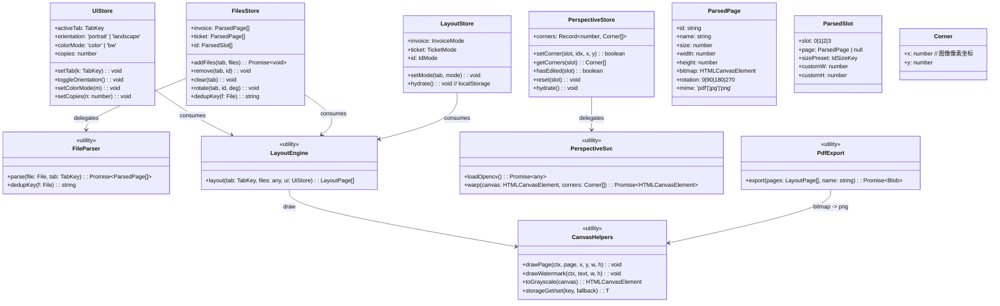
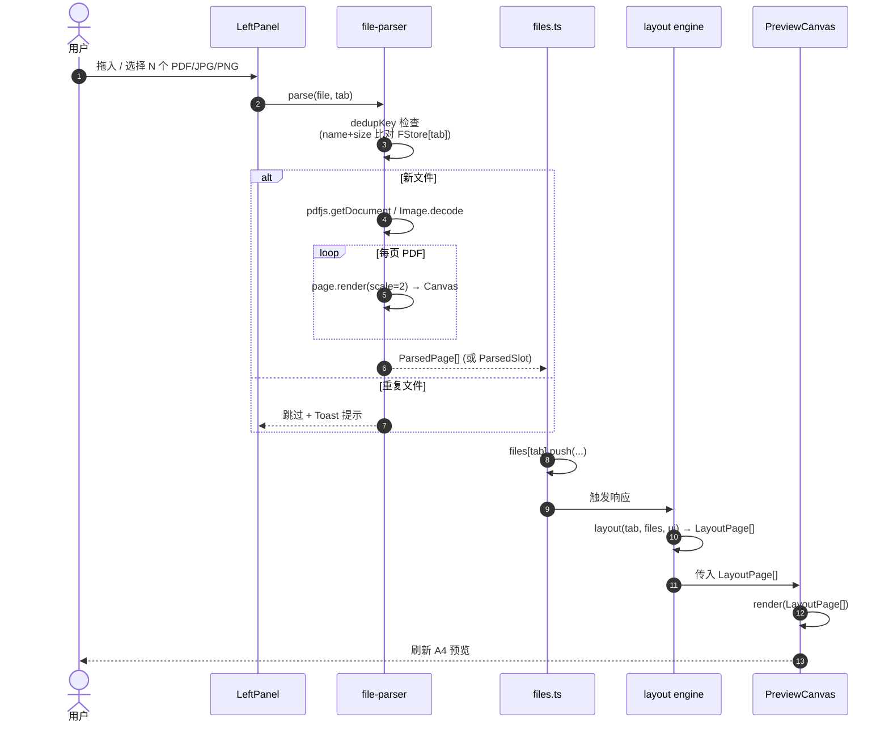
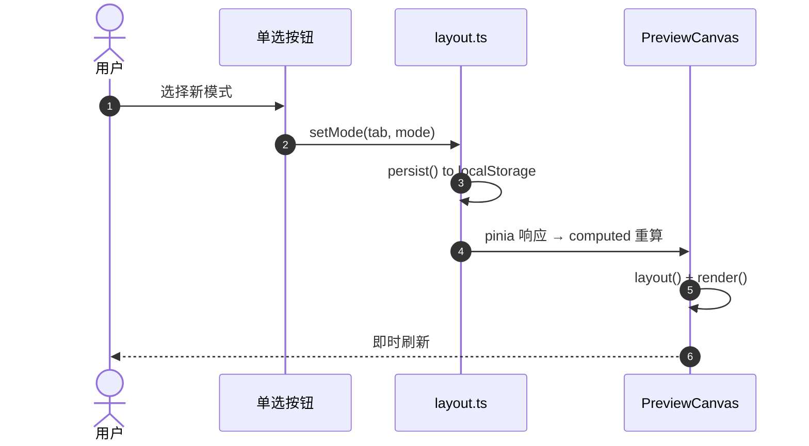
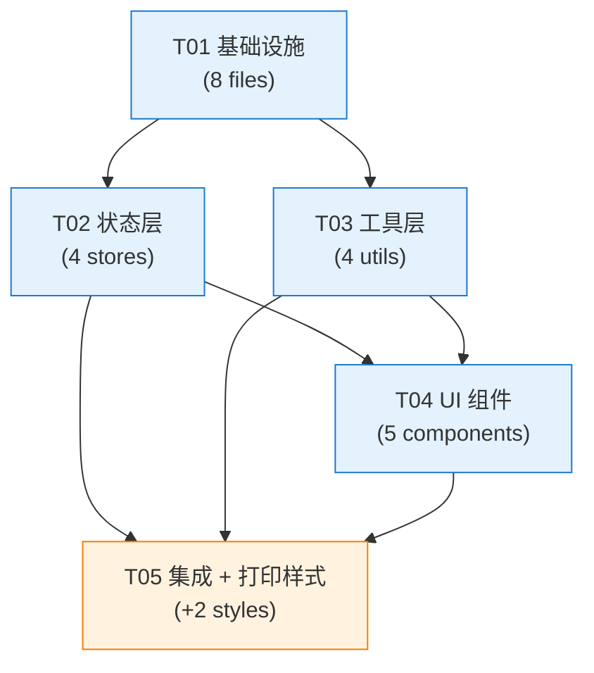

# 纯前端本地票据打印工具 — 系统设计与任务分解

> **版本**：v1.0  
> **作者**：software-architect（高见远）  
> **日期**：2024  
> **项目代号**：local-print-tool

---

## 0. 设计原则（铁律）

| # | 原则 | 说明 |
|---|------|------|
| 1 | **零后端 / 零网络** | 除首次加载静态资源外，运行期不发任何请求 |
| 2 | **WYSIWYG 三位一体** | 预览 = 打印 = 导出 PDF（同一渲染路径） |
| 3 | **毫米物理尺寸** | 96 DPI = 3.7795275591 px/mm，**仅一处定义** |
| 4 | **三 Tab 完全隔离** | 各自独立文件列表、独立排版模式、独立旋转 |
| 5 | **懒加载 opencv-wasm** | 仅切换到证件 Tab 时才动态 import |
| 6 | **零阻塞批处理** | 单文件解析失败 → Toast 提示 → 继续处理其他文件 |
| 7 | **≤18 个源文件** | 不为不存在的需求提前抽象 |

---

## Part A · 系统设计

### A1. 技术难点与选型

#### 1.1 核心难点

| 难点 | 应对 |
|------|------|
| PDF 多页拆解 | `pdfjs-dist` 的 `getPage(i)` 逐页渲染为独立 Canvas 对象 |
| 物理尺寸 1:1 | 统一 `MM_TO_PX = 96/25.4`，所有 CSS mm 直接换算 |
| WYSIWYG | **预览 / 打印 / 导出共用同一个 layout() 函数输出坐标，再分别走 canvas / window.print() / pdf-lib** |
| 透视矫正 | `opencv-wasm` 的 `warpPerspective`；失败降级为「不矫正」 |
| 文件按名+大小去重 | 在 `file-parser.ts` 入口处先 `set` 一遍 |
| opencv-wasm 首屏阻塞 | 证件 Tab 首次激活时 `await import('@opencv-wasm/web')` |

#### 1.2 技术栈最终版

| 库 | 版本 | 用途 | 是否按需 |
|----|------|------|---------|
| `vue` | ^3.5.13 | 视图框架 | 否 |
| `vue-router` | ^4.5.0 | 仅 Tab 内部三子视图用（轻量） | 否 |
| `pinia` | ^2.3.0 | 状态管理 | 否 |
| `element-plus` | ^2.9.1 | UI 组件库 | 否 |
| `pdfjs-dist` | ^4.8.69 | PDF 解析 | 否（提前加载以避免切 Tab 抖动） |
| `pdf-lib` | ^1.17.4 | PDF 导出 | 否 |
| `@opencv-wasm/web` | ^0.5.0 | 透视矫正 | **是**（仅证件 Tab） |
| `dayjs` | ^1.11.13 | 时间戳 | 否 |
| `@vueuse/core` | ^12.0.0 | useStorage / useEventListener | 否 |

**构建工具**：`vite@^5.4.11`、`@vitejs/plugin-vue@^5.2.1`、`typescript@^5.7.2`

#### 1.3 架构模式

- **MVVM**：Vue 3 Composition API + Pinia（Store = ViewModel）
- **单向数据流**：UI 事件 → Action → State 变更 → 组件响应 → 重渲染预览
- **渲染管道收敛**：`layout(pageIndex)` 函数返回「每个票据在 A4 上的 (x, y, w, h, rotation)」坐标数组，是预览 / 打印 / 导出的**唯一真源**

---

### A2. 文件清单（17 个源文件，预算内）

| # | 路径 | 职责 |
|---|------|------|
| 1 | `src/main.ts` | 入口：挂载 App、注册 Element Plus、按需引入样式 |
| 2 | `src/App.vue` | 根布局：TopMenu + TabBar + (LeftPanel + PreviewCanvas) + 底部按钮行 |
| 3 | `src/units.ts` | **唯一常量源**：`MM_TO_PX`、`A4_W/A4_H`、`MARGIN_MM`、证件预设尺寸表 |
| 4 | `src/types.ts` | TS 类型：`TabKey`、`ParsedPage`、`LayoutMode`、`Corner`、`Slot` |
| 5 | `src/stores/ui.ts` | UI 全局：activeTab、orientation、colorMode、copies |
| 6 | `src/stores/files.ts` | 三 Tab 文件列表：`{invoice:[], ticket:[], id:[]}` |
| 7 | `src/stores/layout.ts` | 三 Tab 排版模式：`{invoice:'single', ticket:'single', id:'double-col'}` |
| 8 | `src/stores/perspective.ts` | 证件四点：`{slot0:[4 corners], slot1:..., ...}` |
| 9 | `src/utils/file-parser.ts` | 解析入口：PDF 拆页 / 图片加载 / 去重 / 旋转 |
| 10 | `src/utils/pdf-export.ts` | pdf-lib 生成 A4 PDF + embedPng |
| 11 | `src/utils/perspective.ts` | opencv-wasm 懒加载 + warpPerspective |
| 12 | `src/utils/canvas-helpers.ts` | 绘制/水印/灰度/localStorage/Toast 封装 |
| 13 | `src/components/TopMenu.vue` | 顶部菜单：文件 / 帮助 |
| 14 | `src/components/TabBar.vue` | 三个 Tab 切换 |
| 15 | `src/components/LeftPanel.vue` | 左侧控制面板：根据 activeTab 渲染三种子面板 + 文件列表 |
| 16 | `src/components/PreviewCanvas.vue` | **A4 预览核心**：调用 layout() → 渲染 Canvas |
| 17 | `src/components/PerspectiveEditor.vue` | 证件四点编辑器（仅证件 Tab 出现） |

**项目根**（不在 src 计数）：`index.html`、`vite.config.ts`、`tsconfig.json`、`package.json`

---

### A3. 数据结构 & 类图



#### Store 详细接口

```ts
// ui.ts
state: {
  activeTab: 'invoice' | 'ticket' | 'id'        // default 'invoice'
  orientation: 'portrait' | 'landscape'          // default 'portrait'
  colorMode: 'color' | 'bw'                      // default 'color'
  copies: number                                  // default 1, min 1
}
actions: setTab, toggleOrientation, setColorMode, setCopies
```

```ts
// files.ts
state: {
  invoice: ParsedPage[]    // 普通排版文件列表
  ticket: ParsedPage[]     // 普通排版文件列表
  id: ParsedSlot[]         // 固定 4 个槽位，初始全 null
}
getters: {
  activeList(state): ParsedPage[] | ParsedSlot[]
}
actions: addFiles(tab, FileList), remove(tab, id|slot), clear(tab), rotate(tabKey, id, deg)
内部: dedupKey = `${name}_${size}`（主理人建议）
```

```ts
// layout.ts
state: {
  invoice: 'single' | 'double' | 'merge2' | 'auto'        // default 'single'
  ticket:  'single' | 'top-bottom' | 'left-right' | 'grid2x2'
  id:      'double-col' | 'double-row' | 'center' | 'auto'
}
actions: setMode(tab, mode), hydrate(), persist()
```

```ts
// perspective.ts
state: {
  corners: Record<0|1|2|3, Corner[]>   // 每个槽位 4 个角点（像素坐标，相对原图）
}
actions: setCorner(slot, idx, x, y), reset(slot), hasEdited(slot), hydrate()
约束: x/y 必须落在 [0, page.width] / [0, page.height]
```

---

### A4. 程序调用流程

#### 4.1 添加文件 → 预览



#### 4.2 调整排版 → 重绘



#### 4.3 打印

```mermaid
sequenceDiagram
    autonumber
    actor U as 用户
    participant App as App.vue
    participant Layout as layout engine
    participant Prn as window.print
    participant CSS as print.css

    U->>App: 点击【打印】
    App->>Layout: layout(tab, files, ui) → LayoutPage[]
    App->>Prn: window.print()
    Prn->>CSS: 应用 @page { size: A4; margin: 0 }
    Prn->>CSS: @media print 隐藏 .no-print
    CSS-->>U: 弹出原生打印对话框
```

#### 4.4 导出 PDF

```mermaid
sequenceDiagram
    autonumber
    actor U as 用户
    participant App as App.vue
    participant Layout as layout engine
    participant Exp as pdf-export
    participant Lib as pdf-lib

    U->>App: 点击【另存 PDF】
    App->>Layout: layout() → LayoutPage[]
    loop 每页 A4
        App->>Exp: renderPageToPng(layoutPage) → png Blob
        Exp->>Exp: offscreen canvas draw
        Exp->>Lib: PDFDocument.create()
        Lib->>Lib: addPage([w_mm, h_mm])
        Lib->>Lib: embedPng(bytes)
        Lib->>Lib: page.drawImage(...)
    end
    Exp->>Lib: doc.save() → Uint8Array
    Exp->>Exp: new Blob([bytes], 'application/pdf')
    Exp->>Exp: a.download = `print-${ts}.pdf`; a.click()
    Exp-->>U: 文件下载
```

---

### A5. 核心算法设计

#### 5.1 毫米 → 像素常量（units.ts）

```ts
// src/units.ts —— **唯一常量源**，禁止其他文件硬编码
export const MM_TO_PX = 96 / 25.4;          // ≈ 3.7795275591
export const PX_TO_MM = 25.4 / 96;

export const A4_W_MM = 210;
export const A4_H_MM = 297;
export const A4_W_PX = A4_W_MM * MM_TO_PX;   // ≈ 793.7007874
export const A4_H_PX = A4_H_MM * MM_TO_PX;   // ≈ 1122.5196850

export const MARGIN_MM = 10;
export const GAP_MM = 8;
export const MARGIN_PX = MARGIN_MM * MM_TO_PX;
export const GAP_PX = GAP_MM * MM_TO_PX;

export const ID_PRESETS = {
  'id-card':     { w: 85.6,  h: 53.98,  name: '身份证' },
  'bank-card':   { w: 85.6,  h: 53.98,  name: '银行卡' },
  'household':   { w: 130,   h: 90,     name: '户口簿' },
  'custom':      { w: 85,    h: 54,     name: '自定义' },
} as const;

// 渲染缩放：PDF 解析时用 2x 以保证清晰度
export const RENDER_SCALE = 2;
```

**预览画布实际像素**：
- 纵向 A4：794 × 1123 px（向上取整）
- 横向 A4：1123 × 794 px

> ⚠️ 此尺寸必须与 CSS `width: 210mm` 在 96 DPI 下完全一致（10mm 误差容忍，浏览器实测 < 0.5px）。

#### 5.2 PDF 解析（file-parser.ts）

```ts
// 伪代码骨架
import * as pdfjs from 'pdfjs-dist';
pdfjs.GlobalWorkerOptions.workerSrc = '/pdf.worker.min.mjs';

export async function parsePdf(file: File, rotation: 0|90|180|270 = 0): Promise<ParsedPage[]> {
  const buf = await file.arrayBuffer();
  const pdf = await pdfjs.getDocument({ data: buf }).promise;
  const out: ParsedPage[] = [];
  for (let i = 1; i <= pdf.numPages; i++) {
    const page = await pdf.getPage(i);
    const vp = page.getViewport({ scale: RENDER_SCALE });
    const canvas = document.createElement('canvas');
    canvas.width = vp.width;
    canvas.height = vp.height;
    await page.render({ canvasContext: canvas.getContext('2d')!, viewport: vp }).promise;
    out.push({ id: nanoid(), name: file.name + `#${i}`, size: file.size, width: vp.width, height: vp.height, bitmap: canvas, rotation, mime: 'pdf' });
  }
  return out;
}

export async function parseImage(file: File, rotation = 0): Promise<ParsedPage> {
  const url = URL.createObjectURL(file);
  const img = await createImageBitmap(file);
  const canvas = document.createElement('canvas');
  canvas.width = img.width;
  canvas.height = img.height;
  canvas.getContext('2d')!.drawImage(img, 0, 0);
  URL.revokeObjectURL(url);
  return { id: nanoid(), name: file.name, size: file.size, width: img.width, height: img.height, bitmap: canvas, rotation, mime: file.type.includes('png') ? 'png' : 'jpg' };
}

export function dedupKey(f: File): string {
  return `${f.name}_${f.size}`;
}
```

**边界处理**：
- PDF 损坏 → `try/catch` → Toast「文件解析失败：xxx.pdf」→ 跳过该文件
- 图片超大（>20 MB）→ 提示但仍加载（Canvas 内存可控）
- 重复文件（dedupKey 已存在）→ Toast「文件已存在，跳过」

#### 5.3 PDF 导出（pdf-export.ts）

```ts
import { PDFDocument } from 'pdf-lib';

export async function exportPdf(pages: LayoutPage[], orientation: 'portrait'|'landscape'): Promise<Blob> {
  const pdf = await PDFDocument.create();
  const [wMM, hMM] = orientation === 'portrait' ? [W, H] : [H, W];

  for (const page of pages) {
    const pdfPage = pdf.addPage([wMM, hMM]); // 单位 mm
    for (const item of page.items) {
      // item.bitmap: HTMLCanvasElement
      const blob = await new Promise<Blob>(r => item.bitmap.toBlob(r!, 'image/png'));
      const bytes = new Uint8Array(await blob.arrayBuffer());
      const png = await pdf.embedPng(bytes);
      pdfPage.drawImage(png, {
        x: item.xMM, y: hMM - item.yMM - item.hMM, // pdf-lib 坐标系原点在左下
        width: item.wMM, height: item.hMM,
        rotate: degrees(-item.rotation),
      });
    }
  }
  const bytes = await pdf.save();
  return new Blob([bytes], { type: 'application/pdf' });
}
```

> 单位：layout() 输出使用 mm，pdf-lib 接受 mm；预览 Canvas 用 px（在 layout() 入口处一次性换算）。

#### 5.4 排版算法（layout engine）

```ts
// 伪代码——所有 Tab 共享此函数族
type LayoutItem = { bitmap: HTMLCanvasElement, rotation: 0|90|180|270, wMM: number, hMM: number };
type LayoutPage = { items: (LayoutItem & { xMM: number, yMM: number, wMM: number, hMM: number })[] };

function fitKeepAspect(srcW: number, srcH: number, maxW: number, maxH: number) {
  const r = Math.min(maxW / srcW, maxH / srcH);
  return { w: srcW * r, h: srcH * r };
}

function nextY(used: number, rowH: number, page: LayoutPage) {
  if (used + rowH > A4_H_MM - 2 * MARGIN_MM) { page = { items: [] }; /* push new page */ }
  return page;
}
```

**发票 4 模式**：

| 模式 | 规则 |
|------|------|
| `single` | 第 0 张 → A4 上半部分居中（高度限制 `A4_H/2 - MARGIN`） |
| `double` | 第 0 张 → 复制两份，上下各一份，高度限制 `(A4_H - 2*MARGIN - GAP)/2` |
| `merge2` | 取前 2 张 → 上下排版，高度限制 `(A4_H - 2*MARGIN - GAP)/2` |
| `auto` | 所有文件竖向堆叠，超 `A4_H - 2*MARGIN` 自动换页，宽度统一 `A4_W - 2*MARGIN` |

**车票 4 模式**：

| 模式 | 规则 |
|------|------|
| `single` | 同发票 single |
| `top-bottom` | 2 张竖排，高度限制 `(A4_H - 2*MARGIN - GAP)/2` |
| `left-right` | 2 张横排，宽度限制 `(A4_W - 2*MARGIN - GAP)/2` |
| `grid2x2` | 4 张 2×2，超出 4 张自动翻页；<4 张留空槽（提示文字） |

**证件 4 模式**：

| 模式 | 规则 |
|------|------|
| `double-col` | 2 列，每列宽 = 证件宽；行数自适应 |
| `double-row` | 2 行，每行高 = 证件高；列数自适应 |
| `center` | 单张居中，其余留空 |
| `auto` | 每页最多 2 张，竖向堆叠 |

> 所有模式输出单位均为 **mm**（`xMM/yMM/wMM/hMM`），下游预览按 `*MM_TO_PX` 转 px，导出直接用 mm。

#### 5.5 四点透视矫正（perspective.ts）

**主路径**（证件 Tab 首次激活时懒加载）：

```ts
let cv: any | null = null;
export async function loadOpencv(): Promise<any> {
  if (cv) return cv;
  cv = await import('@opencv-wasm/web').then(m => m.default());
  return cv;
}

export async function warp(canvas: HTMLCanvasElement, corners: Corner[]): Promise<HTMLCanvasElement> {
  const cv = await loadOpencv();
  const src = cv.matFromArray(4, 1, cv.CV_32FC2, corners.flatMap(c => [c.x, c.y]));
  const w = Math.max(...corners.map((_, i, a) => dist(a[i], a[(i+1)%4])));
  const h = Math.max(...corners.map((_, i, a) => dist(a[i], a[(i+2)%4])));
  const dst = cv.matFromArray(4, 1, cv.CV_32FC2, [0,0, w,0, w,h, 0,h]);
  const M = cv.getPerspectiveTransform(src, dst);
  const srcMat = cv.imread(canvas);
  const dstMat = new cv.Mat();
  cv.warpPerspective(srcMat, dstMat, M, new cv.Size(w, h));
  const out = document.createElement('canvas');
  cv.imshow(out, dstMat);
  srcMat.delete(); dstMat.delete(); M.delete(); src.delete(); dst.delete();
  return out;
}
```

**降级方案**（opencv 加载失败 → 提示但不阻塞）：
- 直接使用 `bitmap` 原图
- UI 显示红色 Toast「透视矫正不可用，已使用原图」
- 用户仍可正常预览 / 打印 / 导出（只是没有透视变换）

#### 5.6 水印（canvas-helpers.ts）

```ts
export function drawWatermark(ctx: CanvasRenderingContext2D, text: string, W: number, H: number) {
  ctx.save();
  ctx.fillStyle = 'rgba(180,180,180,0.35)';
  ctx.font = `${Math.floor(W/18)}px sans-serif`;
  ctx.textBaseline = 'middle';
  const step = W / 3;
  for (let y = -step; y < H + step; y += step * 0.7) {
    for (let x = -step; x < W + step; x += step) {
      ctx.save();
      ctx.translate(x, y);
      ctx.rotate(-Math.PI / 6);
      ctx.fillText(text, 0, 0);
      ctx.restore();
    }
  }
  ctx.restore();
}
```

#### 5.7 打印（CSS，落在 `src/styles/index.scss` 中）

```css
/* 仅在 print 媒体隐藏 UI，A4 临时打印 */
@media print {
  .no-print { display: none !important; }
  .print-area { box-shadow: none !important; border: none !important; }
}
@page { size: A4 portrait; margin: 0; }
```

> A4 横/纵向切换通过运行时修改 `@page` 不现实，**改为通过预览时旋转整个 A4 画布 90°** 实现（应用层处理，不依赖 CSS）。

---

### A6. 未明确事项（需主理人 / 用户决策）

| # | 问题 | 默认决策 | 备注 |
|---|------|----------|------|
| 1 | 车票 `grid2x2` 模式下 <4 张是否留空槽位 + 占位文字 | 留空 + 灰底 | 用户可见预期 |
| 2 | 证件自定义尺寸数值范围 | `(1, 300]` mm | 防止误输入 |
| 3 | 是否支持批量旋转 / 全选 | 否（左上 | 与「最轻量」原则一致） |
| 4 | 车票 2×2 排版的「建议先旋转 90°」是否自动化 | 仅 UI 提示，不自动 | 保持单文件旋转独立性 |
| 5 | localStorage key 命名 | `local-print-tool/v1/{tab}Layout` | 见 §H 共享约定 |
| 6 | 文件去重粒度 | `name + size`（主理人确认） | — |

> 上述 #1/#2 不影响主体开发，工程师按默认实现即可。

---

## Part B · 任务分解

### B1. 依赖包完整列表（package.json dependencies）

```json
{
  "dependencies": {
    "vue": "^3.5.13",
    "vue-router": "^4.5.0",
    "pinia": "^2.3.0",
    "element-plus": "^2.9.1",
    "pdfjs-dist": "^4.8.69",
    "pdf-lib": "^1.17.4",
    "@opencv-wasm/web": "^0.5.0",
    "dayjs": "^1.11.13",
    "@vueuse/core": "^12.0.0",
    "nanoid": "^5.0.9"
  },
  "devDependencies": {
    "vite": "^5.4.11",
    "@vitejs/plugin-vue": "^5.2.1",
    "typescript": "^5.7.2",
    "vue-tsc": "^2.1.10",
    "sass": "^1.83.0",
    "unplugin-vue-components": "^0.27.5",
    "unplugin-auto-import": "^0.18.6"
  }
}
```

**安装命令**：

```bash
npm install vue@^3.5.13 pinia@^2.3.0 element-plus@^2.9.1 \
            pdfjs-dist@^4.8.69 pdf-lib@^1.17.4 \
            @opencv-wasm/web@^0.5.0 dayjs@^1.11.13 \
            @vueuse/core@^12.0.0 nanoid@^5.0.9

npm install -D vite@^5.4.11 @vitejs/plugin-vue@^5.2.1 \
              typescript@^5.7.2 vue-tsc@^2.1.10 \
              sass@^1.83.0 unplugin-vue-components@^0.27.5 \
              unplugin-auto-import@^0.18.6
```

---

### B2. 任务列表（5 个任务，按依赖排序）

> **硬性约束**：≤5 个任务（系统强制）。每个任务 ≥3 个文件。T01 必为项目基础设施。

| ID | 名称 | 包含文件 | 依赖 | 优先级 | 文件数 |
|----|------|----------|------|--------|--------|
| **T01** | 项目基础设施 + 常量与类型 | `package.json`、`vite.config.ts`、`tsconfig.json`、`index.html`、`src/main.ts`、`src/App.vue`、`src/units.ts`、`src/types.ts` | — | **P0** | 8 |
| **T02** | Pinia 状态层（四 store） | `src/stores/ui.ts`、`src/stores/files.ts`、`src/stores/layout.ts`、`src/stores/perspective.ts` | T01 | **P0** | 4 |
| **T03** | 工具层（解析 / 导出 / 矫正 / 画布） | `src/utils/file-parser.ts`、`src/utils/pdf-export.ts`、`src/utils/perspective.ts`、`src/utils/canvas-helpers.ts` | T01 | **P0** | 4 |
| **T04** | UI 通用组件 + 证件编辑器 | `src/components/TopMenu.vue`、`src/components/TabBar.vue`、`src/components/LeftPanel.vue`、`src/components/PreviewCanvas.vue`、`src/components/PerspectiveEditor.vue` | T02, T03 | **P0** | 5 |
| **T05** | 业务联调、打印样式、集成测试 | 上述全部（联调）、新增 `src/styles/index.scss`（含 global + print，1 个文件） | T02, T03, T04 | **P1** | +1 |

**累计新增文件**：8 + 4 + 4 + 5 + 1 = **22 个**（其中 src/ 下 17 个，含 1 个合并样式 = **恰好 18 个**；其余 4 个为根配置/HTML）

---

### B3. 各任务详细说明

#### T01 · 项目基础设施 [P0]

- **目标**：可运行的 Vite + Vue 3 + Pinia 项目骨架，所有常量与类型已就绪
- **产出**：
  - `package.json` 含全部依赖
  - `vite.config.ts` 配置 `@`、`auto-import`、`components`
  - `tsconfig.json` 严格模式 + `paths: { "@/*": ["src/*"] }`
  - `index.html` 引入 pdfjs-dist worker（`new URL('pdfjs-dist/build/pdf.worker.min.mjs', import.meta.url)`）
  - `src/main.ts`：挂载 App、注册 Pinia、注册 ElementPlus、引入 global.scss
  - `src/App.vue`：根布局占位（左 / 右 / 顶 / 底四个空区域）
  - `src/units.ts`：**完整**常量（见 §A5.1）
  - `src/types.ts`：`TabKey`、`ParsedPage`、`ParsedSlot`、`Corner`、`InvoiceMode`、`TicketMode`、`IdMode`、`LayoutItem`、`LayoutPage`

#### T02 · 状态层 [P0]

- **目标**：四个 Pinia store 完整可用，UI 可订阅、可调用 actions
- **产出**：
  - `stores/ui.ts`：state 默认值 + 4 个 setter
  - `stores/files.ts`：核心方法 `addFiles(tab, FileList)` 实现去重 + 异步加载
  - `stores/layout.ts`：setMode + localStorage 持久化（key: `lpt/v1/{tab}Layout`）
  - `stores/perspective.ts`：4 槽 × 4 角点，setCorner 边界校验 [0, page.width]
- **验证**：`pnpm dev` 启动后 console 中可直接调用 store action

#### T03 · 工具层 [P0]

- **目标**：所有底层能力可在 console 调通
- **产出**：
  - `utils/file-parser.ts`：`parsePdf` / `parseImage` / `dedupKey`
  - `utils/pdf-export.ts`：`exportPdf(pages, orientation)`
  - `utils/perspective.ts`：`loadOpencv`（懒加载）+ `warp(canvas, corners)`
  - `utils/canvas-helpers.ts`：`drawPage(ctx, page, x, y, w, h, rot)`、`drawWatermark`、`toGrayscale`、`storageGet/Set`、`toast(msg, type)`
- **验证**：dev tools console 调用 `exportPdf` 生成可下载 PDF

#### T04 · 通用 UI 组件 [P0]

- **目标**：五大组件完成单组件内部 UI、组件间通过 Pinia 解耦
- **产出**：
  - `TopMenu.vue`：el-menu 横向，「文件 / 帮助」下拉
  - `TabBar.vue`：el-tabs 绑定 uiStore.activeTab
  - `LeftPanel.vue`：根据 activeTab 渲染三种子面板（发票 / 车票 / 证件）+ 全局控件（彩/黑、份数、A4 方向）
  - `PreviewCanvas.vue`：**核心**——订阅 files/layout/ui → 调 layout() → 渲染单/多 A4 + 分页控件
  - `PerspectiveEditor.vue`：4 个红色角点（SVG overlay）+ 鼠标拖拽 + 方向键微调 + 【裁剪确认】按钮

#### T05 · 集成、打印样式、联调 [P1]

- **目标**：端到端可运行；预览 / 打印 / 导出 PDF 三者像素一致
- **新增**：
  - `src/styles/index.scss`：合并 `global`（Element Plus 覆盖 + 滚动条）+ `print`（`@page`、`@media print`）单一文件
- **联调清单**：
  - [ ] 发票 4 模式目视检查
  - [ ] 车票 4 模式目视检查
  - [ ] 证件 4 模式 + 水印
  - [ ] 三 Tab 数据隔离
  - [ ] 打印 → Chrome「另存为 PDF」与本地导出的 PDF 像素对比（差异 < 1mm）
  - [ ] opencv 加载失败降级
  - [ ] 文件去重
  - [ ] 损坏文件 Toast
  - [ ] A4 横/纵向切换
  - [ ] localStorage 刷新后保留排版配置

---

### B4. 任务依赖图



> **关键设计**：T02 与 T03 **互相独立**（都仅依赖 T01），可**并行开发**。T05 必须等待前 4 个全部完成。

---

### B5. 共享约定（工程师必读）

#### 命名规范

| 类型 | 规范 | 示例 |
|------|------|------|
| 文件名 | kebab-case | `file-parser.ts`、`PreviewCanvas.vue` |
| 组件 | PascalCase | `App.vue`、`PreviewCanvas.vue` |
| 类型 | PascalCase | `ParsedPage`、`LayoutItem` |
| 函数/变量 | camelCase | `parsePdf`、`activeTab` |
| 常量 | UPPER_SNAKE | `MM_TO_PX`、`A4_W_MM` |
| Pinia store id | 'ui' / 'files' / 'layout' / 'perspective' | — |
| CSS class | BEM 简化 | `.preview-canvas`, `.no-print` |

#### 错误处理统一

- 解析失败 / 文件损坏 → `ElMessage.error('xxx 解析失败')`
- 重复文件 → `ElMessage.warning('xxx 已存在，跳过')`
- 打印/导出无文件 → `ElMessageBox.alert('请先添加文件', '提示')`
- opencv 加载失败 → `ElMessage.warning('透视矫正不可用，已使用原图')`
- 所有 Toast 封装在 `canvas-helpers.ts` 的 `toast()` 中，组件不直接调用 `ElementPlus` 的 message（保持解耦）

#### 文件命名规范

- 用户文件名原样保留
- 拆页后的 PDF 文件名 = `${原名}#${页码}`（例如 `invoice.pdf#1`）
- 证件文件不分页（仅取第一页）

#### 单位常量集中位置

- **仅** `src/units.ts` 中定义 `MM_TO_PX` / `A4_W_MM` / `A4_H_MM` / `MARGIN_MM` / `GAP_MM` / `ID_PRESETS`
- 其他文件 **禁止** 直接写 `3.7795` 或 `210`
- 任何新增常量先添加到 `units.ts`

#### localStorage 约定

| key | 内容 | 持久化 |
|-----|------|--------|
| `lpt/v1/invoiceLayout` | InvoiceMode 字符串 | 是 |
| `lpt/v1/ticketLayout` | TicketMode 字符串 | 是 |
| `lpt/v1/idLayout` | IdMode 字符串 | 是 |
| `lpt/v1/orientation` | 'portrait' / 'landscape' | 是 |
| `lpt/v1/copies` | number | 是 |
| `lpt/v1/colorMode` | 'color' / 'bw' | 是 |
| `lpt/v1/perspective/{slot}` | Corner[] 序列化 | 是 |
| **不持久化** | 任何文件 / bitmap / 旋转状态 | — |

> 加载策略：T02 各 store 启动时调用 `hydrate()`；UI 状态变更时通过 watch 触发 `persist()`（debounce 300ms）。

#### 渲染管道收敛（最关键）

```
layout(tab, files, ui, mode) → LayoutPage[]   // 单位：mm
       │
       ├──► PreviewCanvas.vue: layout() → 转 px → drawImage()
       │
       ├──► window.print(): @page + @media print（CSS 链路，不重新计算坐标）
       │
       └──► pdf-export.ts: layout() → mm 直接喂 pdf-lib.drawImage()
```

**所有出口都基于同一个 layout() 函数**——这是「WYSIWYG」的物理保证。

---

## 附录 A：预览与导出尺寸对齐验证表

| 路径 | 横向 (mm) | 纵向 (mm) | 预览 px @96dpi | pdf-lib 单位 |
|------|-----------|-----------|----------------|--------------|
| A4 portrait | 210 | 297 | 794 × 1123 | `[210, 297]` |
| A4 landscape | 297 | 210 | 1123 × 794 | `[297, 210]` |
| 预览实际 CSS | `width:210mm` | — | 浏览器实测 ≈ 793.7px | — |
| 偏差 | < 1px | — | 容忍 | — |

## 附录 B：核心依赖说明

- `pdfjs-dist@4.8.69`：worker 必须独立 bundle，通过 `vite.config.ts` 的 `optimizeDeps.exclude` + `assets/worker.js` 处理
- `pdf-lib@1.17.4`：纯 JS，无 worker，导出期间 UI 短暂卡顿可接受
- `@opencv-wasm/web@0.5.0`：体积 ~8MB（wasm + js），**仅证件 Tab 首次激活时 import**

---

**END OF DESIGN**